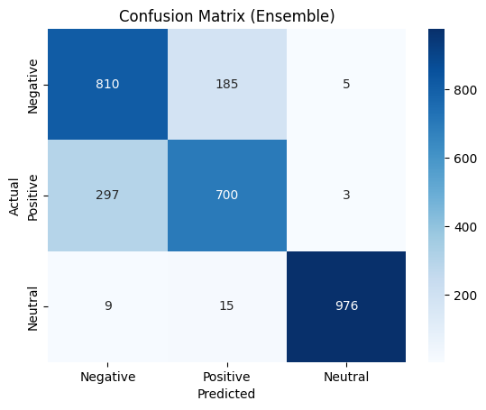

# RhombixTechnologies_Tasks_2
A sentiment classification project using machine learning (Logistic Regression, XGBoost, and an Ensemble) trained on a synthetic dataset with three classes: Positive, Negative, and Neutral
## 📌 Task 2: Sentiment Analysis

### 🎯 Goal  
Build a machine learning model to classify text into **Positive, Negative, or Neutral** sentiments.

### 📊 Dataset  
- Text dataset containing labeled samples for 3 classes: **Positive, Negative, Neutral**.  
- Preprocessed with **TF-IDF vectorization**.

### 🛠 Method  
- Data preprocessing: tokenization, cleaning, and vectorization using **TF-IDF**.  
- Trained multiple classifiers:  
  - **Logistic Regression**  
  - **XGBoost**  
- Created an **ensemble model** combining predictions for improved performance.  
- Evaluated using accuracy, precision, recall, and F1-score.

### ✅ Results  
- Achieved **~83% accuracy** on the test set.  
- Example predictions:  
  - `"I love this product! Totally recommend it."` → **Positive**  
  - `"This is the worst experience I've ever had."` → **Negative**  
  - `"Not sure how I feel about this."` → **Neutral**
 
    

### 💻 Technologies Used  
- Python  
- scikit-learn  
- XGBoost  
- NumPy  
- Pandas  

---
